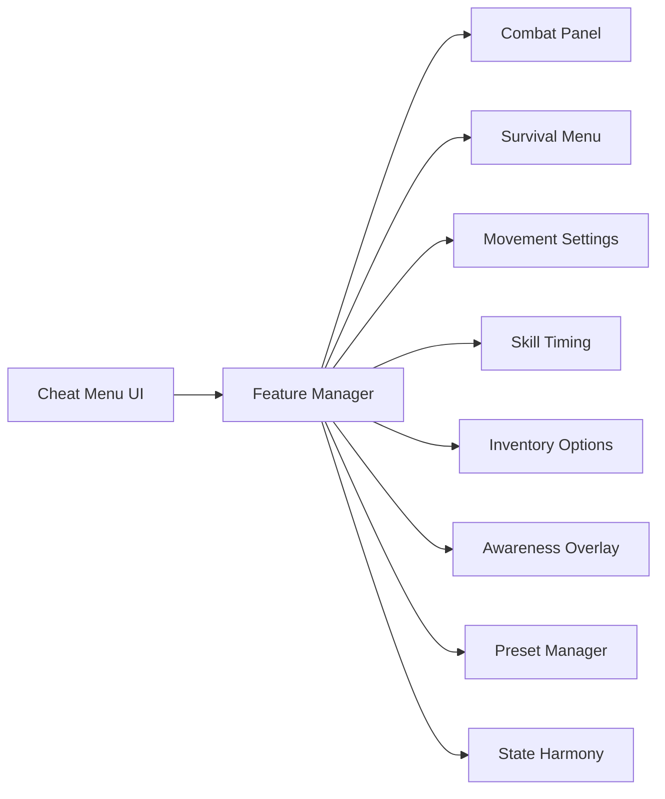

## Overview

Outward 2 Cheat Menu is a session-scoped control interface designed to organize gameplay adjustments for **Outward 2** into a single, accessible menu. It functions as an external companion layer, allowing features to be enabled, tuned, or paused in real time without altering original files or save data. The menu emphasizes clarity and balance, grouping survival comfort, combat pacing, exploration support, and awareness tools into clearly separated panels that can operate independently and reset cleanly at session end.

## Central Feature Switchboard 🧩

* Clearly segmented feature categories
* Instant enable and disable toggles
* Live state indicators
* Lightweight, non-intrusive interface

**In-game behavior:**
Acts as the command surface that distributes toggle states to active modules without interrupting gameplay flow.

## Combat Pace Control Panel 🗡️

* Damage output adjustment
* Incoming damage moderation
* Impact timing refinement
* Context-sensitive combat options

**Feature intent:**
Allows combat behavior to be shaped gently through calculation-level adjustments rather than rigid overrides.

## Survival and Endurance Menu 🌾

* Stamina drain pacing
* Hunger and thirst moderation
* Recovery speed tuning
* Threshold-based comfort limits

**In-game behavior:**
Supports longer journeys by smoothing survival mechanics while preserving challenge structure.

## Movement and Expedition Settings 🧭

* Walk, run, and sprint refinement
* Jump and climb tuning
* Fall impact softening
* Terrain interaction smoothing

**Feature intent:**
Improves travel comfort by applying gradual movement adjustments prior to physics resolution.

## Skill Timing and Cooldown Panel ⏳

* Cooldown pause toggles
* Recovery timing adjustment
* Skill-specific timing rules
* Conditional activation handling

**In-game behavior:**
Keeps skill usage fluid and readable without removing decision-making from the player.

## Inventory and Carry Balance Options 🎒

* Carry weight flexibility
* Encumbrance pacing control
* Item interaction tuning
* Pickup handling balance

**Feature intent:**
Reduces inventory friction by regulating weight and handling calculations during runtime.

## World Awareness and Overlay Menu 👁️

* Enemy and creature highlights
* Distance-based visibility ranges
* Line-of-sight consideration
* Soft overlay presentation

**In-game behavior:**
Adds subtle visual cues through an external overlay layer that respects immersion and clarity.

## Preset and Profile Organizer 📂

* Multiple saved presets
* Seamless switching during play
* Version-safe configuration storage
* Gentle fallback recovery

**Feature intent:**
Keeps personal menu configurations organized and reusable across sessions.

## Safety and State Harmony Layer 🤍

* Soft state coordination
* Priority-aware feature handling
* Automatic state release
* Clean session reset routines

**In-game behavior:**
Ensures all enabled menu features coexist peacefully and disengage smoothly when the session ends.

## FAQ

**Is the cheat menu always visible?**
No. The interface can be shown or hidden at any time.

**Do menu changes apply instantly?**
Yes. Most options update smoothly in real time.

**Can features be enabled separately?**
Yes. Each panel operates independently.

**Are presets saved between sessions?**
Yes. Presets are stored locally.

**Can presets be switched while playing?**
Yes. Switching does not interrupt gameplay.

**Does the menu affect performance?**
Overlay refresh rates and updates are configurable to manage overhead.

## Feature Summary

* Centralized cheat menu interface
* Combat pace and balance controls
* Survival and endurance adjustments
* Movement and expedition comfort settings
* Skill timing and cooldown management
* Inventory and carry balance options
* World awareness and overlay features
* Preset management and state harmony handling

---
